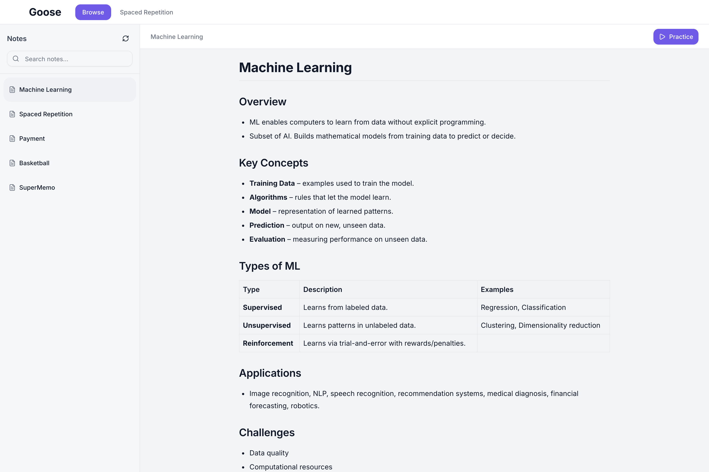
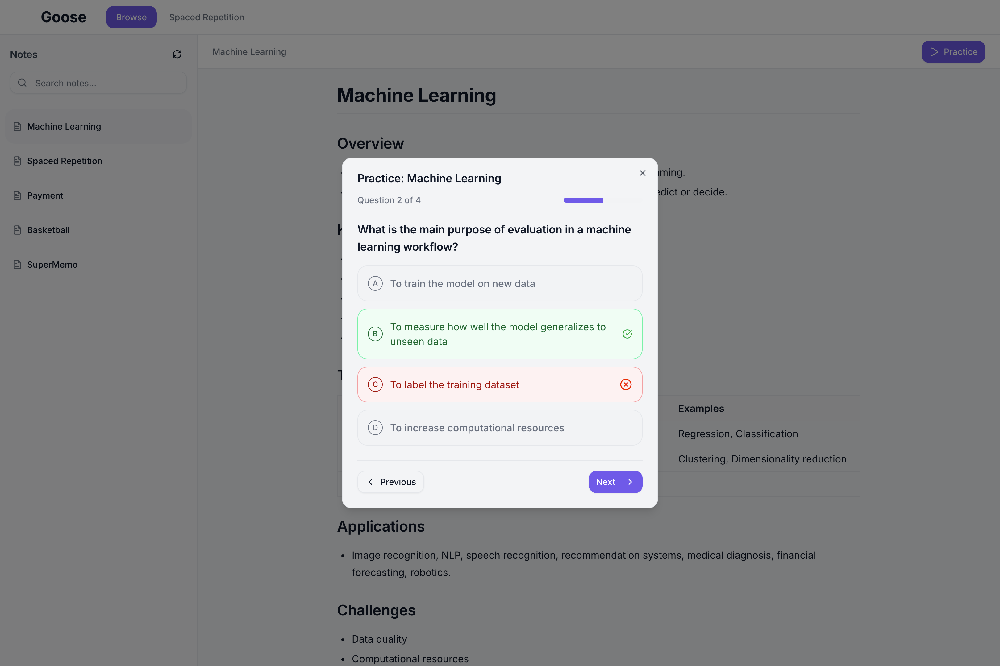
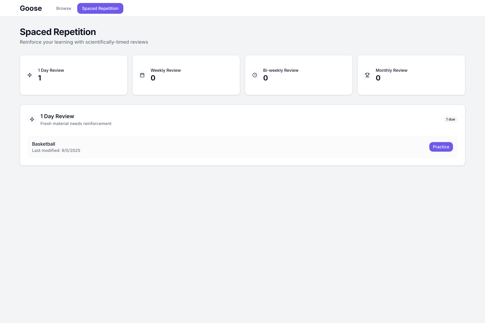

# Goose

Goose is your personal learning assistant, keeping track of websites you visit and helping you remember all the little things you learn each day.

## Inspiration

There are two problems I wanted to solve:

1. I often find it hard to remember all the things I learn about on a daily basis unless I take notes and remember to look back at them later. I wanted a way to make it easier for me to remember these things.
2. LLMs are great for education, but in most cases, they just sit around passively until you go out of your way to ask it a question. I wanted to use them more proactively, actively taking notes and preparing questions for me without me needing to do anything extra on my end.

## Installation

Goose consists of three parts, all of which can be run locally: the backend, frontend, and Chrome extension. Start by cloning this repository.

### Chrome Extension

To install the Chrome extension:

1. Open Chrome then go to chrome://extensions
2. Enable "Developer mode" at the top right if it isn't already enabled
3. Click "Load unpacked" then select the `chrome-extension` directory

This should add the extension to Chrome. No other steps are necessary.

### Backend

1. `cd` into the `backend` directory
2. Run `uv sync`
3. Run `source .venv/bin/activate`
4. Create a `config.py` file with your desired notes location and database file name. `config.example.py` is an example.
4. Run `fastapi dev main.py`

### Frontend

1. `cd` into the `frontend` directory
2. Run `npm install`
3. Run `npm run dev`

## Usage

Once you have all three parts installed and running, Goose will automatically generate notes based on the websites you visit. It only takes notes for websites likely to have "learning material", like Wikipedia. Since everything runs locally, you don't need to worry about your browsing history being saved on the cloud!

To view the notes, open the frontend by going to http://localhost:3000/. Here, you should be able to browse the notes, separated by topic.

You can click the practice button to get practice questions.

You get immediate feedback after answering each question.

To promote remembering the content that you learn, Goose makes use of [spaced repetition](https://en.wikipedia.org/wiki/Spaced_repetition). This is an evidence-based learning technique, where the basic idea is that you recall the content at gradually increasing intervals. Goose keeps track of when you initially learned each piece of content to quiz you at the appropriate times.

By consistently doing the spaced repetition quizzes, you can build up your streak!

## Implementation

The Chrome extension plays a very simple role, just forwarding the URLs that the user visits to the backend.

The backend was built using [FastAPI](https://fastapi.tiangolo.com/). It uses a [SQLite](https://sqlite.org/) database to keep track of questions and stores notes as files on the user's system (meaning the user could use a Markdown editor like [Obsidian](https://obsidian.md/) if they want to manually edit the notes). It keeps a queue of resources that need to be processed; webpages that are not for learning are ignored. For each resource, it goes through the following process:

1. The webpage is converted to Markdown using [Markdowner](https://github.com/supermemoryai/markdowner).
2. A gpt-oss-20b agent, implemented using the [OpenAI Agents SDK](https://github.com/openai/openai-agents-python), summarizes the webpage and uses tools to update or create new notes as necessary. The model runs locally using [LM Studio](https://lmstudio.ai/) and [LiteLLM](https://www.litellm.ai/) is used to connect the Agents SDK to the LM Studio server.
3. Another gpt-oss-20b agent generates practice questions for the updated notes and stores them in the SQLite database.

The frontend is built using [Next.js](https://nextjs.org/) (generated using [Orchids](https://www.orchids.app/)). It keeps track of the daily streak and which reviews have been completed using the browser's local storage.
